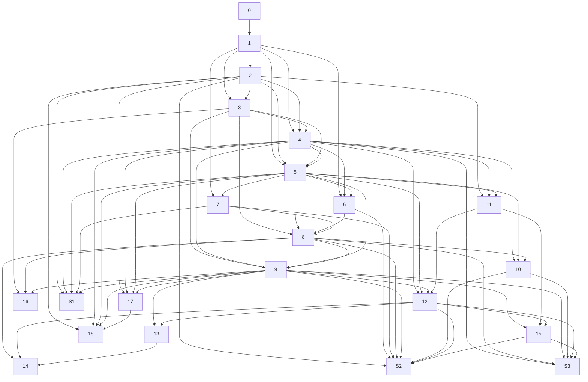

# 条目依赖关系图

本文根据当前目录下全部 Markdown 条目的主题与正文结构，整理出一个适合阅读顺序的“直接依赖关系”图。

- 箭头方向表示“前者是后者的前置概念”。
- 主线条目沿用原编号 `0`–`18`。
- 3 篇无编号补充条目记为 `S1`–`S3` ：
  - `S1`：`列型空间.md`
  - `S2`：`P-空间.md`
  - `S3`：`拓扑维数1.md`

## 编号对应表

- `0`：`拓扑学入门0——欧几里得空间的拓扑.md`
- `1`：`拓扑学入门1——拓扑空间.md`
- `2`：`拓扑学入门2——邻域、邻域基.md`
- `3`：`拓扑学入门3——基.md`
- `4`：`拓扑学入门4——闭包和内部.md`
- `5`：`拓扑学入门5——连续映射.md`
- `6`：`拓扑学入门6——相对拓扑.md`
- `7`：`拓扑学入门7——商拓扑.md`
- `8`：`拓扑学入门8——积拓扑、和拓扑.md`
- `9`：`拓扑学入门9——紧性.md`
- `10`：`拓扑学入门10——连通性.md`
- `11`：`拓扑学入门11——分离公理1.md`
- `12`：`拓扑学入门12——分离公理2.md`
- `13`：`拓扑学入门13——距离空间的拓扑1.md`
- `14`：`拓扑学入门14——距离空间的拓扑2.md`
- `15`：`拓扑学入门15——局部紧空间.md`
- `16`：`拓扑学入门16——吉洪诺夫Tychonoff定理.md`
- `17`：`拓扑学入门17——滤子.md`
- `18`：`拓扑学入门18——网.md`
- `S1`：`列型空间.md`
- `S2`：`P-空间.md`
- `S3`：`拓扑维数1.md`
